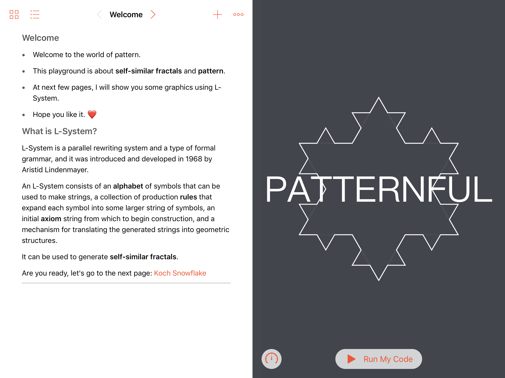

### Welcome
* Welcome to the world of pattern. 
* This playground is about **self-similar fractals** and **pattern**.
* At next few pages, I will show you some graphics using L-System. 
* Hope you like it. ❤️

#### What is L-System?
L-System is a parallel rewriting system and a type of formal grammar, and it was introduced and developed in 1968 by Aristid Lindenmayer. 

An L-System consists of an **alphabet** of symbols that can be used to make strings, a collection of production **rules** that expand each symbol into some larger string of symbols, an initial **axiom** string from which to begin construction, and a mechanism for translating the generated strings into geometric structures. 

It can be used to generate **self-similar fractals**. 

